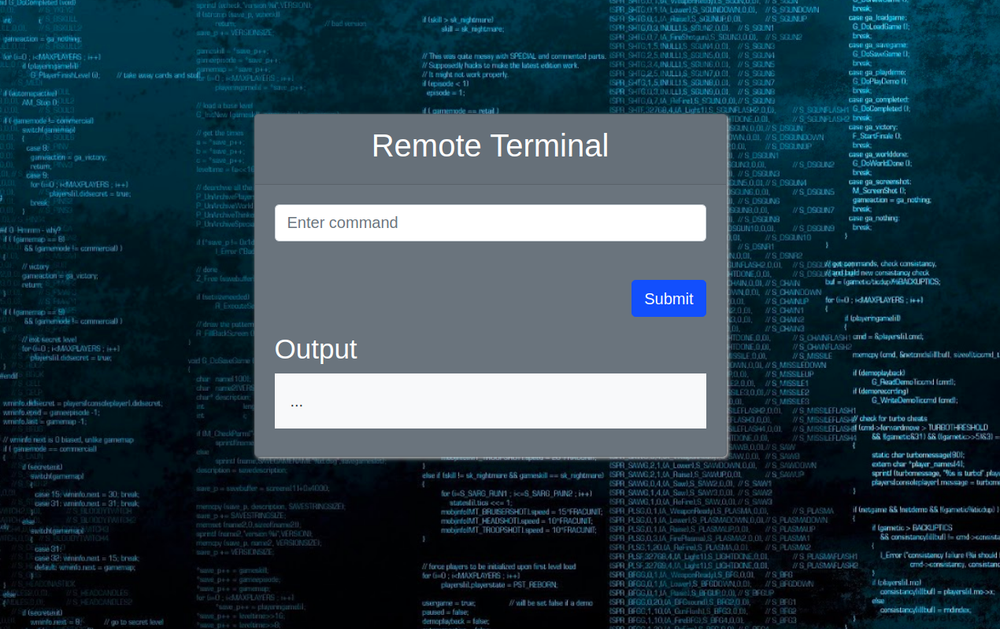

# Remote Terminal
   
A webapp that can be used to access a system terminal from any device over the same network.
  

# Steps 
Execute the following commands to run the webapp over the system IP.
* export FLASK_APP=webapp.py
* flask run -h Ip.add.rr.ess
